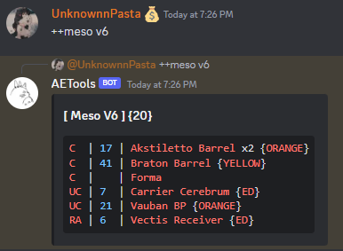
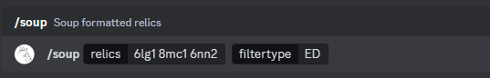
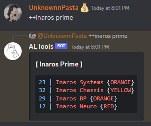

<div align='center'>

  <div>
    
  </div>

  


<hr />

### AETools is a multipurpose utility bot for a staff team, inspired by [Zlushiie](https://github.com/Zlushiie).

</div>

<br />

# Introduction
Being used since 2022, the bot has many functions which are used constantly, every day. To name a few,

## API Calls
- Utilizes [Warframe](https://www.warframe.com)'s endpoint to track all available fissures through Cloudfare Workers
- Utilizes Warframe's endpoint to get, format, and display game data through discord command

## Features
<p align="center">
  <a href="#squad-hosting">Squad Hosting</a> •
  <a href="#merching">Merching Relics</a> •
  <a href="#relic-viewing">Viewing Relics</a> •
  <a href="#prime-sets">Viewing Prime Sets</a> •
  <a href="#prime-parts">Viewing Relics For a Part</a> •
  <a href="#part-availability">Viewing Stock</a> •
  <a href="#clan-resources">Viewing Clan Resources</a>
</p>

<br />

# Commands

**\*IMPORTANT\*** To preface, all commands are used in discord by prefacing them with a Slash ("/"), and typing required options in given choice boxes. This is shown in the examples aswell.

The only exception to this is the "++" commands; which are used to check relics, status and prime frames/weapons/etc

Command arguments with \`*\` in front are optional arguments. Ones without are compulsory.

## Relic viewing

Command Syntax: `++RELIC NAME` or `++SHORTHAND`

Here:
- `RELIC NAME` can be anything like **Axi L6** or **Lith G1**
- `SHORTHAND` is stuff like **al6** or **lg1**
    Eg. a relic name **Lith G1** can be shortened to the **relic era** i.e. "Lith" => "L" and **relic type**, which is "G1"

    Hence making the shorthand `LG1` or `lg1`

Example:

<div></div>

**\*NOTE\***: The blue text is the stock of the part in the relic, C/UC/RA means COMMON/UNCOMMON/RARE and the number in **{}** is the token value of the relic.

Parts with **x2** next to them require 2 of the part to count for 1 stock.

ORANGE/etc means the same as it does in [here](https://docs.google.com/document/d/1syjdKLIhfIoAvNFwHtO4yBQjSZTOe869az9xaMBPQrc/edit#heading=h.vfg2mm7li9ri)

## Squad Hosting

### 1. Treasury  [ *DEPRECATED* ]

Command Syntax: `/thost count:NUMBER relic:RELIC *type:TYPE`

Here:
- `count` is the number of relics you want to host
    It can be a **multiple of 3**, like *6, 12, etc* but *NOT any number less than 6*.
- `relic` is the relic you want to host. This follows the same format as [Relic Viewing](#relic-viewing).
- `type` is a OPTIONAL choice, used to indicate whether a run is a treasury (normal), free (Bois) or a pre-filled squad host (prehost)

Example:

<div></div>

The bot will host a squad as:

<div></div>

And after getting 4 members, the bot will ping all squad members. The host then invites them and runs the relic.

### 2. Farmer

Command Syntax: `/fhost mission:TEXT resource:RESOURCE frame:FRAME missiontype:TYPE *duration:TIME`

Here:
- `TEXT` is the description of the mission being run. Eg. For a run in void survival on ani, you'd write `Ani - void`
- `RESOURCE` is the resource being farmed, selected from the autofill choice that pops up on typing the resource name.
- `FRAME` is the selected frame that the host (you) will be using.
- `TYPE` is the mission type from the available choices: DEFENSE/SURVIVAL/EXCAVATION
- `TIME` is the duration of the run in minutes, as a number eg. 180

Example:

<div></div>

## Part Availability

Used for checking what parts have a status

Command Syntax: `++STATUS`

where status (about this [here](https://docs.google.com/document/d/1syjdKLIhfIoAvNFwHtO4yBQjSZTOe869az9xaMBPQrc/edit#heading=h.vfg2mm7li9ri)) is ED / ORANGE / RED / YELLOW / GREEN

## Merching

As a merchant, it is important to post relics in the  channel.
Heres how you do it.

Command Syntax: `/soup relics:RELICTEXT *filtertype:TYPE`

Here:
- `relics` is a series of relics that you want to soup.
    Each souped relic is given using SHORTHAND syntax shown in [Relic Viewing](#relic-viewing), i.e. `6lg1`, where 6 is the quantity of relics you own and lg1 the relic itself.

    You can give a series of relics and their quantity, seperated by space or just a single relic.
- `filtertype` is a OPTIONAL choice, that allows you to filter all relics that aren't ED/RED/ORANGE (more about this [here](https://docs.google.com/document/d/1syjdKLIhfIoAvNFwHtO4yBQjSZTOe869az9xaMBPQrc/edit#heading=h.vfg2mm7li9ri))

Example:

<div></div>

After this, the bot replies as:

<div></div>

You can post this text in  or , if the relics are pre-radded.

### Resouping relics

Once you posted the relics, the relics will no longer have the correct ED/etc numbers as members of treasury may have run the relic. It can be tiring to fetch the same relic code you used to soup them, then run it through /soup again.

To remedy this, you can use `/resoup`

Command Syntax: `/resoup relics:SOUPTEXT *filtertype:TYPE`

Here in `SOUPTEXT`, you place the massive text you get from `/soup`. The bot will give you the soup text with updated ED/RED/ORANGE values.

Example: 

<div></div>

## Prime Sets

To know which relics to run, you need to check their stocks. You can use the `++` syntax to see the stock of prime warframes.

Command Sytax: `++FRAME prime`

Here, FRAME is the name of the frame to fetch. like: `++vauban prime`

Example: 

<div></div>

**\*NOTE\***:
The blue numbers indicate the stock, and ORANGE/ED/etc means exactly what it means. (incase you forgot, [see this](https://docs.google.com/document/d/1syjdKLIhfIoAvNFwHtO4yBQjSZTOe869az9xaMBPQrc/edit#heading=h.vfg2mm7li9ri))

Things like AND in names are substituted with &, eg. `cobra & crane prime`

## Prime Parts

After knowing what prime frames/weapons/etc are in ED Stock, you can check what relics have those prime parts.

Command Syntax: `++PART`

Here `PART` is any prime part, like `++mirage systems`, without the "prime" word.

Some words like **Neuroptics**, **Systems**, etc. can be shortened to their first few letters, like `++mirage neuro` or `++inaros sys`
**Blueprint** can be shortened to `++kronen bp`

## Clan Resources

For farmers, it is necessary to see what resources are in low stock for their clan. This can be done via:


1. `/resource resource:NAME`
    - NAME is the name of the resource to see. \*MAKE SURE TO SELECT THE NAME FROM AUTOCOMPLETE LIST, ABOVE WHERE YOU TYPED THE COMMAND\*
    - Example: <div></div>


2. `/clan clan:NAME`
    - NAME is any choice from the choices list, shown in example
    - Example: <div></div>

<br />

# Contributing to the bot

Are you well versed in Javascript and want to help develop the bot? Here's how you can do it.

## Pre-requisites

To work on the bot, make sure you have the following:

- Node.js - version ^18.x.x
- Git - latest

## Working on the bot

BEFORE you run this, do make sure you have up-to-date tools to work with:

- `node --version` says a version greater than or equal to 18.x.x
- `git --version` says a verion greater than or equal to 2.4x.x

Clone the project:

```shell
git clone https://github.com/UnKnownnPasta/NotAETools && cd NotAETools && touch .env && npm install
```

Run the bot:

```shell
npm run dev
```

## Deploying the bot

To deploy the bot, you need to follow these steps:

1. Make sure you have up-to-date tools to work with:
    - `node --version` says a version greater than or equal to 18.x.x
    - `git --version` says a verion greater than or equal to 2.4x.x

2. Clone the project:

```shell
git clone https://github.com/UnKnownnPasta/NotAETools
```

3. Run the bot:

```shell
npm run prod
```